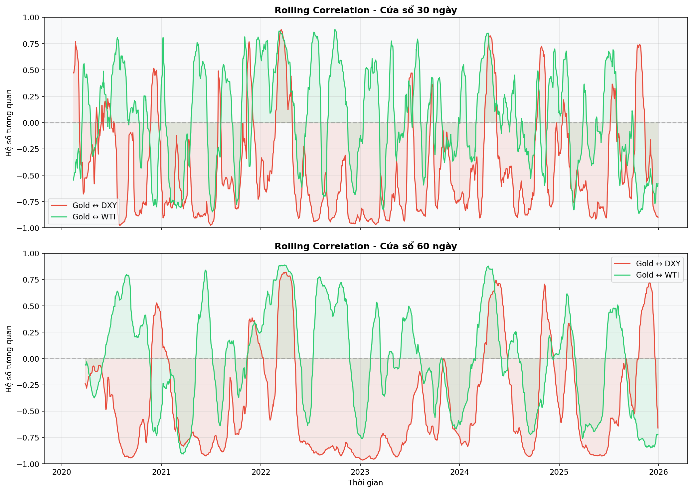
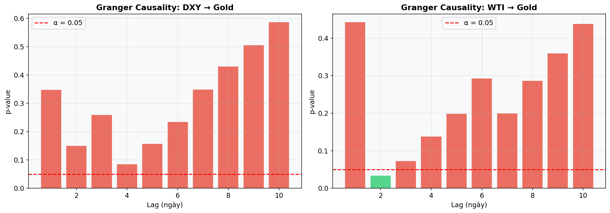
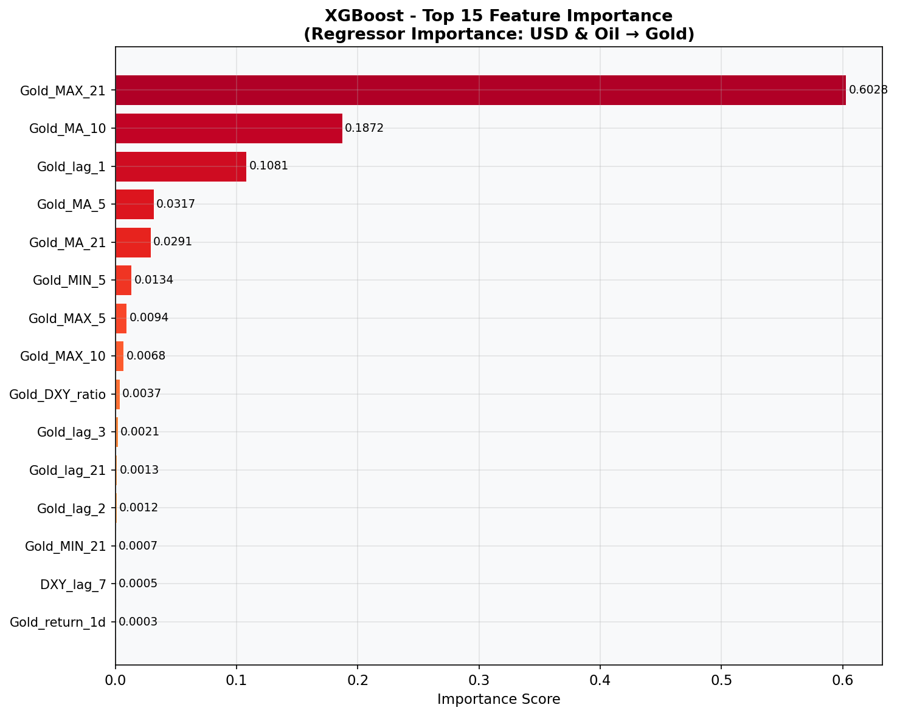
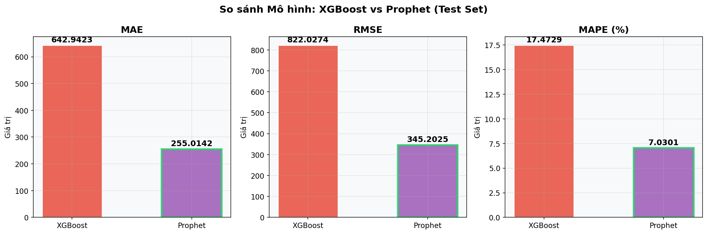
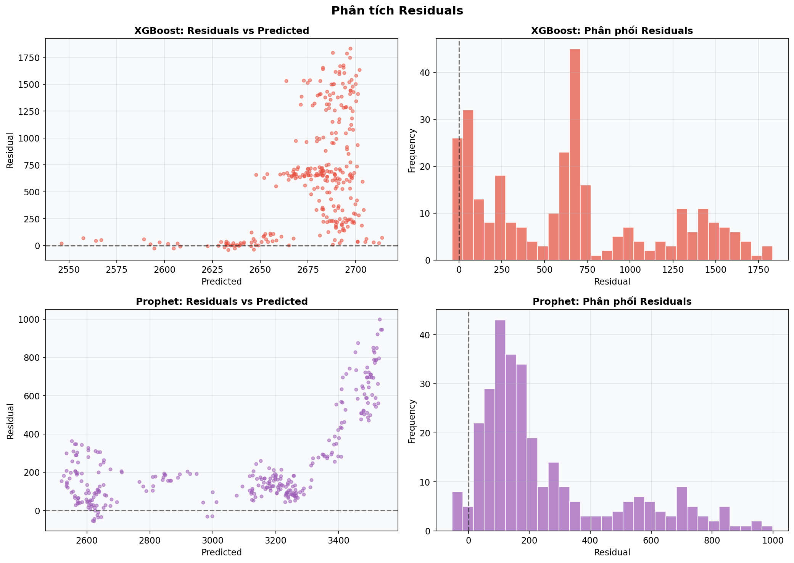
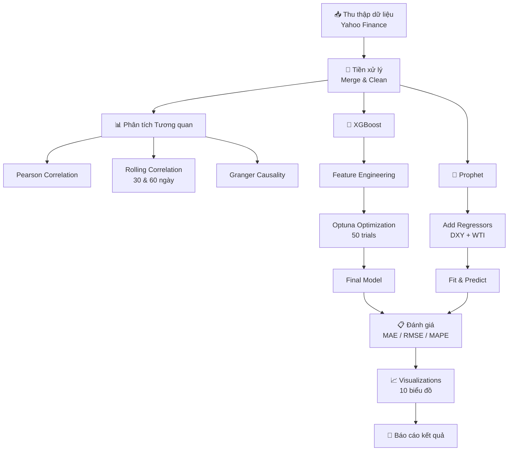

# 🚀 Dự án Antigravity: Phân tích Liên thị trường & Dự báo Giá Vàng

> **Ghi chú:** Tài liệu này phục vụ cho mục đích học thuật và nghiên cứu trong dự án Antigravity.

---

## 📋 Mục tiêu chiến lược

| Mục tiêu | Mô tả |
|-----------|--------|
| **Phân tích tương quan** | Xác định mối liên kết động giữa Vàng (Gold), Dầu thô (WTI) và Chỉ số USD (DXY) |
| **Dự báo (Forecasting)** | So sánh hiệu suất giữa mô hình Machine Learning (**XGBoost**) và mô hình thống kê hiện đại (**Prophet**) |

---

## 📁 Cấu trúc dự án

```
antigravity/
├── main.py                  # Pipeline chính (chạy tuần tự toàn bộ quy trình)
├── data_collection.py       # Giai đoạn 1: Thu thập dữ liệu từ Yahoo Finance
├── correlation_analysis.py  # Giai đoạn 2: Phân tích tương quan nâng cao
├── model_xgboost.py         # Giai đoạn 3A: Mô hình XGBoost + Optuna
├── model_prophet.py         # Giai đoạn 3B: Mô hình Prophet
├── evaluation.py            # Giai đoạn 4: Đánh giá & so sánh
├── visualizations.py        # Giai đoạn 5: Tạo biểu đồ
├── requirements.txt         # Thư viện cần thiết
├── data/                    # Dữ liệu đã thu thập
│   ├── merged_data.csv
│   └── prophet_data.csv
└── output/                  # Kết quả
    ├── report.txt
    ├── xgboost_best_params.json
    └── figures/             # Tất cả biểu đồ (.png)
```

---

## ⚙️ Cài đặt & Chạy

```bash
# 1. Cài đặt thư viện
pip install -r requirements.txt

# 2. Chạy toàn bộ pipeline
python main.py
```

> **Windows:** Nếu gặp lỗi Unicode, chạy:
> ```powershell
> $env:PYTHONIOENCODING='utf-8'; python main.py
> ```

---

## 📊 Báo cáo kết quả

### 1. Tổng quan dữ liệu

| Thông số | Giá trị |
|----------|---------|
| Nguồn dữ liệu | Yahoo Finance (`yfinance`) |
| Số bản ghi | **1,508** phiên giao dịch |
| Khoảng thời gian | 02/01/2020 → 30/12/2025 |
| Biến số | Gold (`GC=F`), WTI (`CL=F`), DXY (`DX-Y.NYB`) |

**Biểu đồ giá lịch sử:**


---

### 2. Phân tích tương quan

#### 2.1. Ma trận Pearson (Static Correlation)

|       | Gold    | WTI     | DXY     |
|-------|---------|---------|---------|
| **Gold**  | 1.0000  | -0.0728 | 0.1014  |
| **WTI**   | -0.0728 | 1.0000  | 0.4654  |
| **DXY**   | 0.1014  | 0.4654  | 1.0000  |

**Nhận xét:**
- **Gold ↔ WTI:** Tương quan âm rất yếu (−0.073) — Vàng và Dầu di chuyển gần như độc lập.
- **Gold ↔ DXY:** Tương quan dương yếu (+0.101) — Khác với lý thuyết truyền thống (USD mạnh → Vàng giảm), giai đoạn 2020-2025 cho thấy mối quan hệ nghịch không còn rõ ràng.
- **WTI ↔ DXY:** Tương quan dương trung bình (+0.465) — Đáng chú ý nhất trong bộ dữ liệu.


#### 2.2. Rolling Correlation (Cửa sổ 30 & 60 ngày)

Mối tương quan **thay đổi đáng kể** theo thời gian, cho thấy mối quan hệ giữa các tài sản không cố định mà phụ thuộc vào điều kiện thị trường.



#### 2.3. Granger Causality

Kiểm tra tính dẫn dắt (nhân quả Granger) tại mức ý nghĩa α = 0.05:

| Quan hệ | Lag tốt nhất | p-value | Kết luận |
|---------|-------------|---------|----------|
| **DXY → Gold** | 4 ngày | 0.0845 | ❌ KHÔNG có nhân quả Granger |
| **WTI → Gold** | 2 ngày | 0.0333 | ✅ CÓ nhân quả Granger |

**Nhận xét:** Biến động giá dầu WTI có khả năng dự báo (dẫn dắt) giá vàng với độ trễ 2 ngày, trong khi chỉ số USD không đủ bằng chứng thống kê.



---

### 3. Decomposition (Prophet)

Prophet phân tách giá vàng thành các thành phần:

- **Trend (Xu hướng):** Xu hướng tăng dài hạn rõ rệt, đặc biệt tăng mạnh từ 2024.
- **Seasonality (Tính mùa vụ):** Biến động theo chu kỳ tuần và năm.


---

### 4. Regressor Importance (XGBoost Feature Importance)

Top 10 biến quan trọng nhất trong mô hình XGBoost:

| # | Feature | Importance | Ý nghĩa |
|---|---------|-----------|----------|
| 1 | `Gold_MAX_21` | **0.6028** | Giá cao nhất 21 ngày gần nhất |
| 2 | `Gold_MA_10` | 0.1872 | Trung bình 10 ngày |
| 3 | `Gold_lag_1` | 0.1081 | Giá vàng ngày hôm trước |
| 4 | `Gold_MA_5` | 0.0317 | Trung bình 5 ngày |
| 5 | `Gold_MA_21` | 0.0291 | Trung bình 21 ngày |
| 6 | `Gold_MIN_5` | 0.0134 | Giá thấp nhất 5 ngày |
| 7 | `Gold_MAX_5` | 0.0094 | Giá cao nhất 5 ngày |
| 8 | `Gold_MAX_10` | 0.0068 | Giá cao nhất 10 ngày |
| 9 | `Gold_DXY_ratio` | **0.0037** | Tỷ lệ Gold/DXY |
| 10 | `Gold_lag_3` | 0.0021 | Giá vàng 3 ngày trước |

**Nhận xét:**
- Giá vàng lịch sử (lag, MA, MIN/MAX) chiếm **>99%** tổng importance → Giá vàng có tính **tự tương quan** rất cao.
- Biến ngoại sinh (DXY, WTI) đóng góp rất nhỏ trong mô hình XGBoost, trong khi Prophet sử dụng chúng hiệu quả hơn dưới dạng regressors.



---

### 5. So sánh Mô hình (Model Comparison)

#### 5.1. Tham số tối ưu XGBoost (Optuna - 50 trials)

| Tham số | Giá trị | Nhóm |
|---------|---------|------|
| `learning_rate` | 0.2958 | Tốc độ học |
| `n_estimators` | 632 | Số lượng cây |
| `max_depth` | 6 | Độ phức tạp |
| `min_child_weight` | 5 | Chống Overfitting |
| `gamma` | 0.9834 | Chống Overfitting |
| `subsample` | 0.7085 | Chống Overfitting |
| `colsample_bytree` | 0.9465 | Chống Overfitting |
| `reg_alpha` | 0.1221 | Regularization (L1) |
| `reg_lambda` | 0.0024 | Regularization (L2) |

#### 5.2. Bảng so sánh Metrics

| Mô hình | MAE | RMSE | MAPE (%) |
|---------|-----|------|----------|
| XGBoost (Train) | 1.04 | 1.35 | 0.06 |
| Prophet (Train) | 22.58 | 29.17 | 1.20 |
| **XGBoost (Test)** | 642.94 | 822.03 | 17.47 |
| **Prophet (Test)** | **255.01** | **345.20** | **7.03** |

#### 5.3. Kết luận

| Chỉ số | Mô hình thắng | Giá trị | Cải thiện so với đối thủ |
|--------|---------------|---------|-------------------------|
| MAE | 🔮 **Prophet** | 255.01 vs 642.94 | **−60.3%** |
| RMSE | 🔮 **Prophet** | 345.20 vs 822.03 | **−58.0%** |
| MAPE | 🔮 **Prophet** | 7.03% vs 17.47% | **−59.8%** |

> ### 🏆 Prophet thắng 3/3 chỉ số trên tập Test
>
> **XGBoost** đạt Train RMSE = 1.35 nhưng Test RMSE = 822.03 → **Overfitting nghiêm trọng**, mặc dù đã áp dụng regularization và Optuna tuning.
>
> **Prophet** tổng quát hóa tốt hơn nhờ mô hình additive + regressors ngoại sinh (DXY, WTI), sai số dự báo thấp và ổn định.



---

### 6. Biểu đồ Actual vs Predicted


---

### 7. Phân tích Residuals



---

## 🛠️ Công nghệ sử dụng

| Thư viện | Phiên bản | Mục đích |
|----------|-----------|----------|
| `yfinance` | ≥0.2.31 | Thu thập dữ liệu tài chính |
| `pandas` | ≥2.0.0 | Xử lý dữ liệu |
| `numpy` | ≥1.24.0 | Tính toán số học |
| `matplotlib` | ≥3.7.0 | Trực quan hóa |
| `seaborn` | ≥0.12.0 | Heatmap thống kê |
| `scikit-learn` | ≥1.3.0 | Metrics đánh giá |
| `xgboost` | ≥2.0.0 | Mô hình Gradient Boosting |
| `optuna` | ≥3.4.0 | Bayesian Optimization |
| `prophet` | ≥1.1.5 | Mô hình dự báo chuỗi thời gian |
| `statsmodels` | ≥0.14.0 | Granger Causality Test |

---

## 📄 Quy trình phân tích (Workflow)



---

*Dự án Antigravity — Phục vụ mục đích học thuật và nghiên cứu.*
