# 🚀 Dự án Antigravity: Phân tích Liên thị trường & Dự báo Giá Vàng

> **Ghi chú:** Tài liệu này phục vụ cho mục đích học thuật và nghiên cứu trong dự án Antigravity.

---

## 📋 Mục tiêu chiến lược

| Mục tiêu | Mô tả |
|-----------|--------|
| **Phân tích tương quan** | Xác định mối liên kết động giữa Vàng (Gold), Dầu thô (WTI) và Chỉ số USD (DXY) |
| **Dự báo (Forecasting)** | So sánh hiệu suất giữa mô hình Machine Learning (**XGBoost**) và mô hình thống kê hiện đại (**Prophet**) |
| **So sánh liên giai đoạn** | Phân tích sự thay đổi trong mối quan hệ liên thị trường giữa **2014-2019** (Pre-COVID) và **2020-2025** (Post-COVID) |

---

## 📁 Cấu trúc dự án

```
antigravity/
├── main.py                  # Pipeline chính (chạy cả 2 giai đoạn + so sánh)
├── data_collection.py       # Thu thập dữ liệu từ Yahoo Finance
├── correlation_analysis.py  # Phân tích tương quan nâng cao
├── model_xgboost.py         # XGBoost + Optuna Bayesian Optimization
├── model_prophet.py         # Prophet + Regressors ngoại sinh
├── evaluation.py            # Đánh giá & so sánh mô hình
├── visualizations.py        # Tạo biểu đồ
├── period_comparison.py     # So sánh liên giai đoạn
├── requirements.txt
├── data/
└── output/
    ├── report.txt
    ├── xgboost_best_params.json
    └── figures/             # ~24 biểu đồ
```

---

## ⚙️ Cài đặt & Chạy

```bash
# 1. Cài đặt thư viện
pip install -r requirements.txt

# 2. Chạy toàn bộ pipeline (cả 2 giai đoạn)
python main.py
```

> **Windows:** Nếu gặp lỗi Unicode:
> ```powershell
> $env:PYTHONIOENCODING='utf-8'; python main.py
> ```

---

## 📊 Báo cáo kết quả

---

### PHẦN A: GIAI ĐOẠN 2014-2019 (Pre-COVID)

#### 1. Dữ liệu

| Thông số | Giá trị |
|----------|---------|
| Số bản ghi | **1,481** phiên giao dịch |
| Khoảng thời gian | 02/01/2014 → 30/12/2019 |

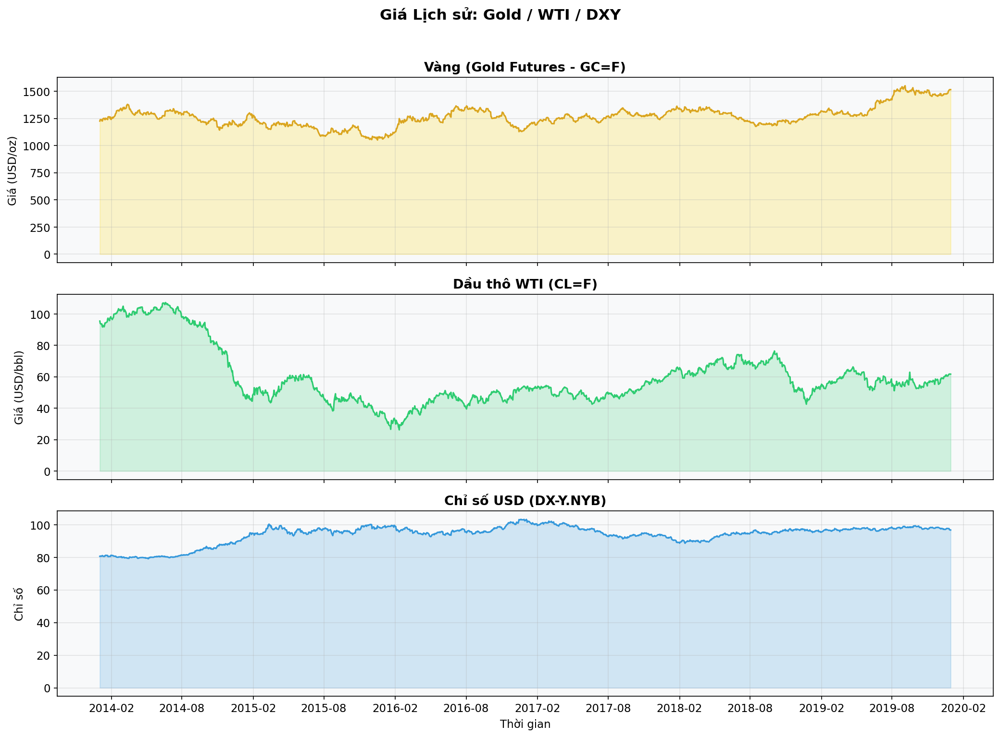

#### 2. Tương quan Pearson

|       | Gold    | WTI      | DXY      |
|-------|---------|----------|----------|
| **Gold**  | 1.0000  | **0.1976**   | **-0.1123**  |
| **WTI**   | 0.1976  | 1.0000   | **-0.8520**  |
| **DXY**   | -0.1123 | -0.8520  | 1.0000   |

**Nhận xét 2014-2019:**
- **Gold ↔ WTI:** Tương quan dương yếu (+0.198) — Vàng và Dầu cùng chiều nhẹ.
- **Gold ↔ DXY:** Tương quan âm yếu (−0.112) — Đúng lý thuyết truyền thống (USD mạnh → Vàng giảm).
- **WTI ↔ DXY:** Tương quan âm **rất mạnh** (−0.852) — USD và Dầu di chuyển ngược chiều rõ rệt.

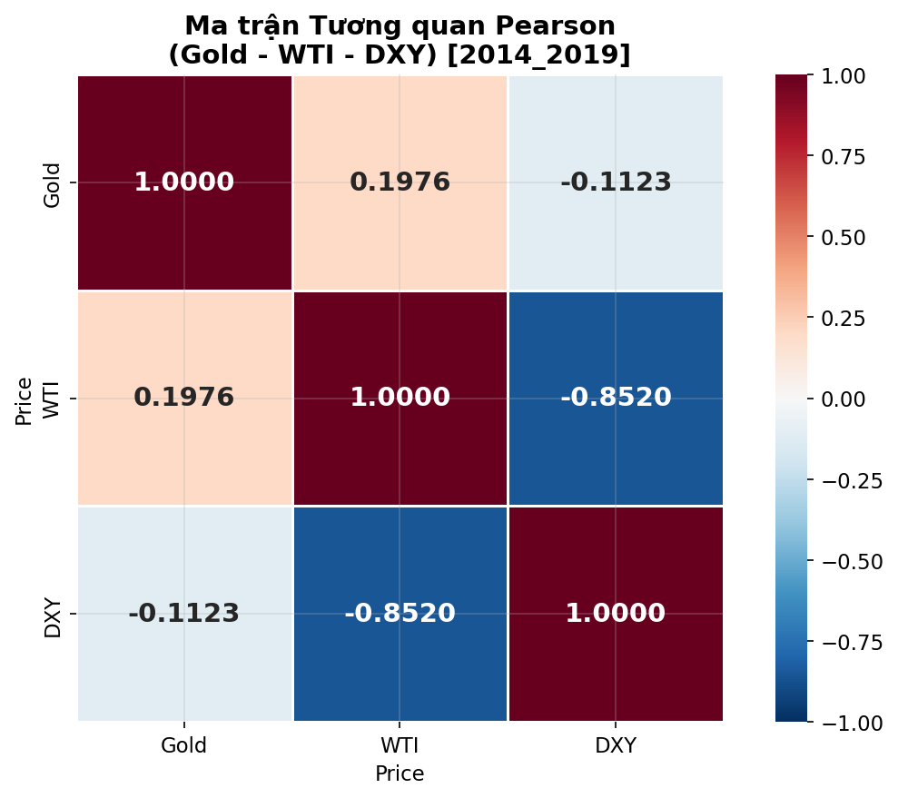

#### 3. Granger Causality (2014-2019)

| Quan hệ | Lag | p-value | Kết luận |
|---------|-----|---------|----------|
| **DXY → Gold** | 7 | 0.0382 | ✅ CÓ nhân quả Granger |
| **WTI → Gold** | 4 | 0.2844 | ❌ KHÔNG |

#### 4. So sánh Mô hình (2014-2019)

| Mô hình | MAE | RMSE | MAPE (%) |
|---------|-----|------|----------|
| **XGBoost (Test)** | **54.30** | **83.88** | **3.66** |
| Prophet (Test) | 208.81 | 249.93 | 14.63 |

> **🤖 XGBoost thắng 3/3 chỉ số** trong giai đoạn 2014-2019.

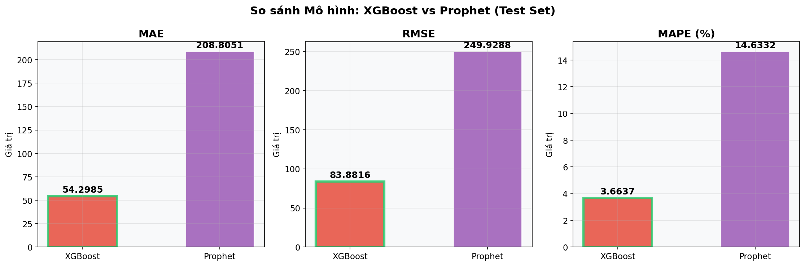

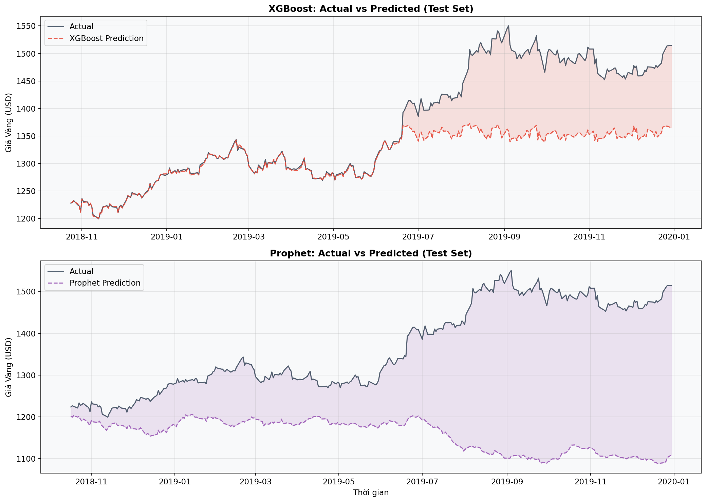

---

### PHẦN B: GIAI ĐOẠN 2020-2025 (Post-COVID)

#### 1. Dữ liệu

| Thông số | Giá trị |
|----------|---------|
| Số bản ghi | **1,508** phiên giao dịch |
| Khoảng thời gian | 02/01/2020 → 30/12/2025 |

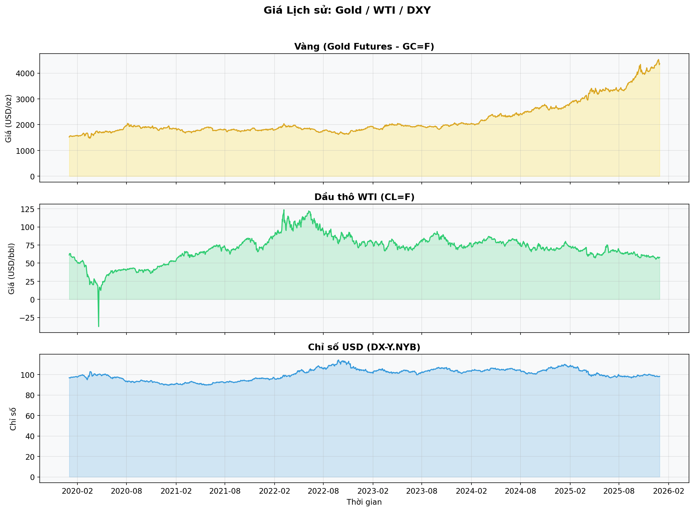

#### 2. Tương quan Pearson

|       | Gold     | WTI      | DXY      |
|-------|----------|----------|----------|
| **Gold**  | 1.0000   | **-0.0728**  | **0.1014**   |
| **WTI**   | -0.0728  | 1.0000   | **0.4654**   |
| **DXY**   | 0.1014   | 0.4654   | 1.0000   |

**Nhận xét 2020-2025:**
- **Gold ↔ WTI:** Tương quan âm rất yếu (−0.073) — Gần như độc lập.
- **Gold ↔ DXY:** Tương quan dương yếu (+0.101) — **Đảo chiều** so với giai đoạn trước!
- **WTI ↔ DXY:** Tương quan dương trung bình (+0.465) — **Đảo chiều hoàn toàn** từ −0.852.

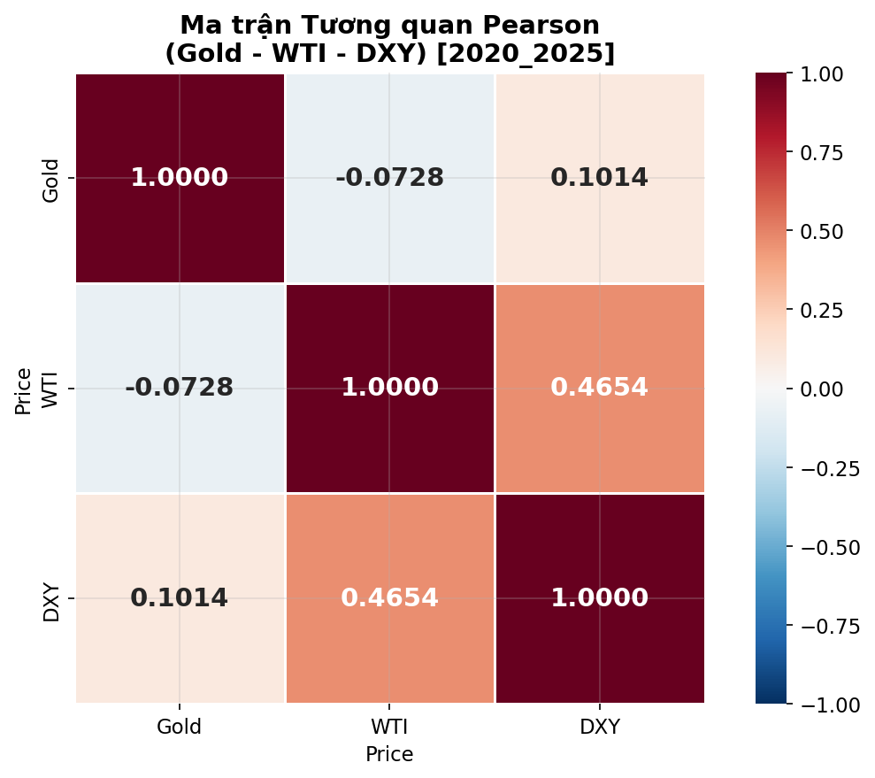

#### 3. Granger Causality (2020-2025)

| Quan hệ | Lag | p-value | Kết luận |
|---------|-----|---------|----------|
| **DXY → Gold** | 4 | 0.0845 | ❌ KHÔNG |
| **WTI → Gold** | 2 | 0.0333 | ✅ CÓ nhân quả Granger |

#### 4. So sánh Mô hình (2020-2025)

| Mô hình | MAE | RMSE | MAPE (%) |
|---------|-----|------|----------|
| XGBoost (Test) | 640.28 | 813.66 | 17.44 |
| **Prophet (Test)** | **255.01** | **345.20** | **7.03** |

> **🔮 Prophet thắng 3/3 chỉ số** trong giai đoạn 2020-2025.


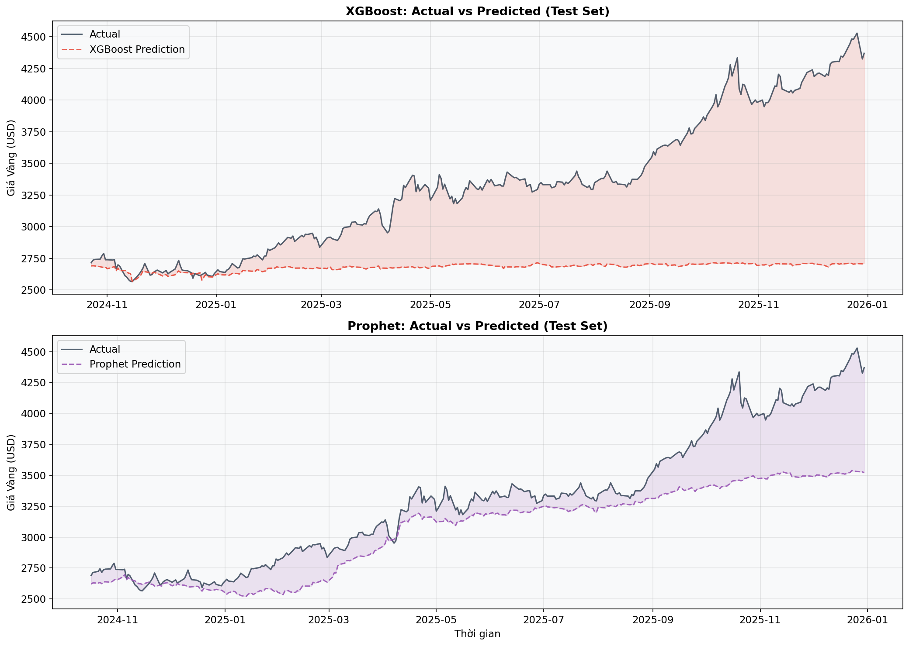

---

### PHẦN C: SO SÁNH LIÊN GIAI ĐOẠN

#### 1. Thay đổi Tương quan Pearson

| Cặp | 2014-2019 | 2020-2025 | Thay đổi |
|-----|-----------|-----------|----------|
| **Gold ↔ WTI** | +0.1976 | −0.0728 | ↓ 0.2704 |
| **Gold ↔ DXY** | −0.1123 | +0.1014 | ↑ 0.2137 (đảo chiều) |
| **WTI ↔ DXY** | **−0.8520** | **+0.4654** | ↑ **1.3174** (đảo chiều hoàn toàn) |

> ⚠️ **Phát hiện quan trọng:** Mối quan hệ WTI ↔ DXY đã **đảo chiều hoàn toàn** từ tương quan âm rất mạnh (−0.852) sang dương trung bình (+0.465). Điều này phản ánh sự thay đổi cơ cấu trong thị trường tài chính toàn cầu sau đại dịch COVID-19.

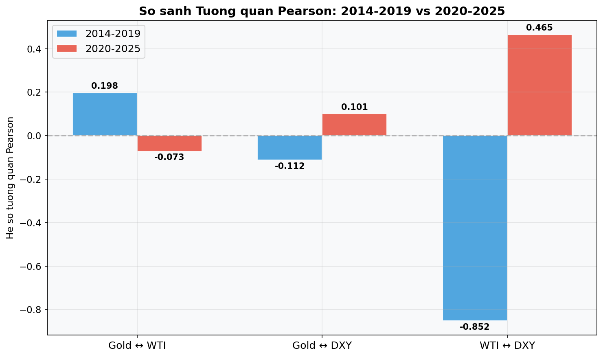

#### 2. Thay đổi Granger Causality

| Quan hệ | 2014-2019 | 2020-2025 | Nhận xét |
|---------|-----------|-----------|----------|
| **DXY → Gold** | ✅ CÓ (p=0.038) | ❌ KHÔNG (p=0.085) | USD mất khả năng dẫn dắt Vàng |
| **WTI → Gold** | ❌ KHÔNG (p=0.284) | ✅ CÓ (p=0.033) | Dầu thô trở thành yếu tố dẫn dắt mới |

> **Nhận xét:** Sau COVID-19, USD mất vai trò dẫn dắt với Vàng, trong khi Dầu thô trở thành yếu tố có ý nghĩa thống kê trong việc dự báo giá Vàng.

#### 3. Thay đổi Hiệu suất Mô hình

| Mô hình | Chỉ số | 2014-2019 | 2020-2025 | Thay đổi |
|---------|--------|-----------|-----------|----------|
| XGBoost | MAE | 54.30 | 640.28 | ↑ Tệ hơn (1079%) |
| XGBoost | RMSE | 83.88 | 813.66 | ↑ Tệ hơn (870%) |
| XGBoost | MAPE | 3.66% | 17.44% | ↑ Tệ hơn (376%) |
| Prophet | MAE | 208.81 | 255.01 | ↑ Tệ hơn (22%) |
| Prophet | RMSE | 249.93 | 345.20 | ↑ Tệ hơn (38%) |
| Prophet | MAPE | 14.63% | 7.03% | ↓ **Tốt hơn (52%)** |

> **Kết luận:**
> - **XGBoost** hoạt động tốt trong thị trường ổn định (2014-2019) nhưng **suy giảm nghiêm trọng** trong thị trường biến động (2020-2025).
> - **Prophet** ổn định hơn giữa hai giai đoạn, và thậm chí cải thiện MAPE từ 14.6% xuống 7.0% nhờ khả năng nắm bắt xu hướng (trend) mạnh mẽ.
> - Mô hình thắng **đảo chiều**: XGBoost thắng ở 2014-2019 → Prophet thắng ở 2020-2025.

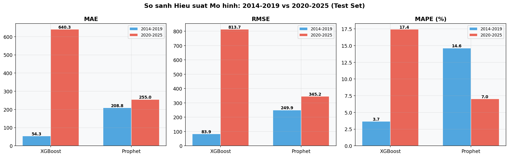

#### 4. So sánh Giá Vàng

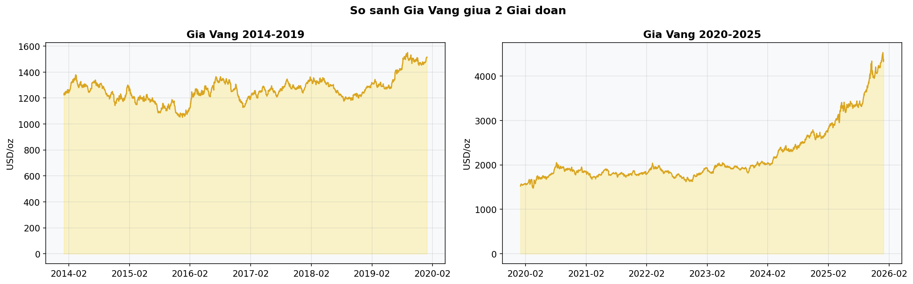

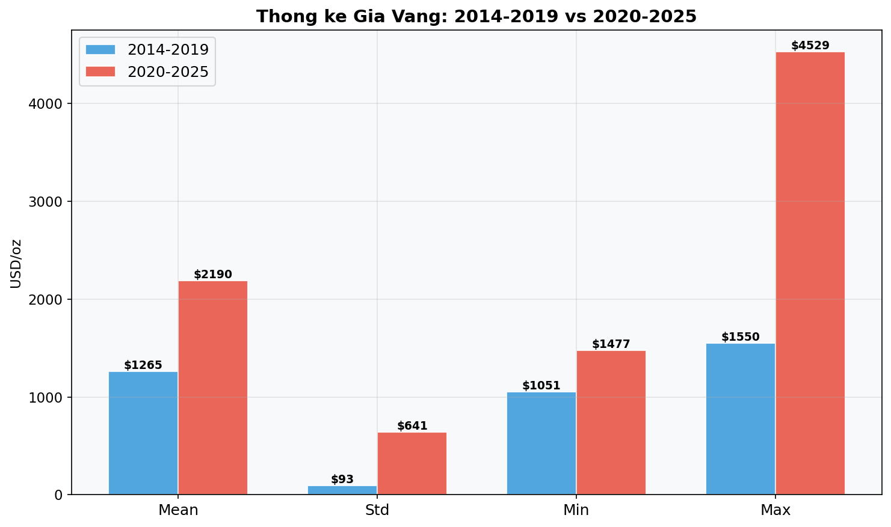

---

### Decomposition (Prophet)

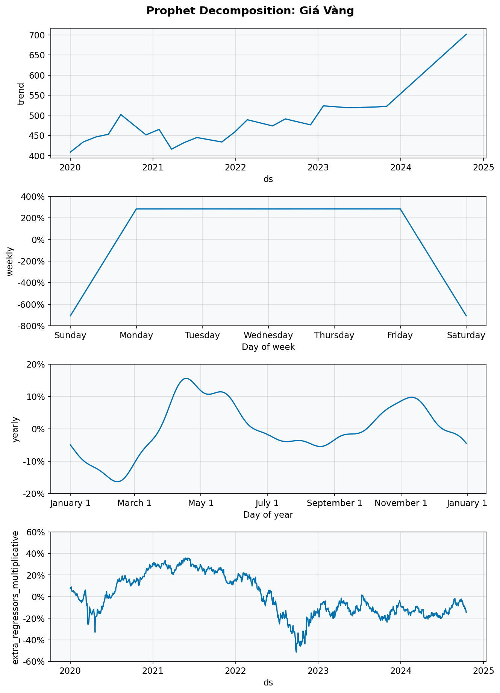

### Feature Importance (XGBoost)

| Giai đoạn | # | Feature | Ý nghĩa |
|-----------|---|---------|----------|
| 2014-2019 | 1 | `Gold_MAX_21` | Giá cao nhất 21 ngày |
| 2014-2019 | 2 | `Gold_lag_1` | Giá hôm trước |
| 2020-2025 | 1 | `Gold_MAX_21` | Giá cao nhất 21 ngày |
| 2020-2025 | 2 | `Gold_MA_10` | Trung bình 10 ngày |

Trong cả hai giai đoạn, `Gold_MAX_21` là feature quan trọng nhất (~60% importance).

---

## 🛠️ Công nghệ sử dụng

| Thư viện | Mục đích |
|----------|----------|
| `yfinance` | Thu thập dữ liệu tài chính |
| `pandas`, `numpy` | Xử lý dữ liệu |
| `matplotlib`, `seaborn` | Trực quan hóa |
| `scikit-learn` | Metrics đánh giá |
| `xgboost` | Gradient Boosting |
| `optuna` | Bayesian Optimization |
| `prophet` | Dự báo chuỗi thời gian |
| `statsmodels` | Granger Causality Test |

---

## 📄 Quy trình phân tích

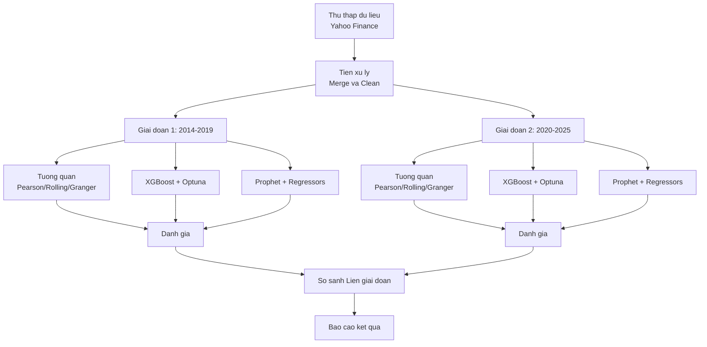

---

